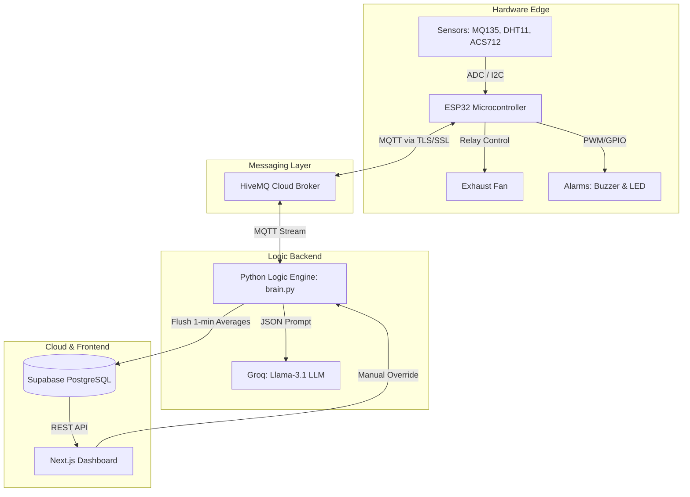

# AeroSmart 🌪️ 
**AI-Powered Environmental Intelligence & Predictive Maintenance IoT Platform**

[](#)
[](#)
[](#)
[](#)
[](#)
[](#)

---

## Table of Contents
1. [Project Overview](#1-project-overview)
2. [System Architecture](#2-system-architecture)
3. [Sensors & Hardware Specification](#3-sensors--hardware-specification)
4. [The XAI Hazard Scoring Engine](#4-the-xai-hazard-scoring-engine-core-algorithm)
5. [Predictive Maintenance Engine](#5-predictive-maintenance-engine)
6. [Hardware Safety Sequence](#6-hardware-safety-sequence-non-blocking-state-machine)
7. [MQTT Communication Protocol](#7-mqtt-communication-protocol)
8. [Database Schema](#8-database-schema-supabase)
9. [Frontend Dashboard](#9-frontend-dashboard-nextjs)
10. [Project File Structure](#10-project-file-structure)
11. [Setup & Installation Guide](#11-setup--installation-guide)
12. [Environment Variables Reference](#12-environment-variables-reference)
13. [System Limitations & Future Work](#13-system-limitations--future-work)
14. [License](#14-license)

---

## 1. Project Overview

AeroSmart is an enterprise-grade Internet of Things (IoT) platform engineered to solve two critical industrial problems: **reactive environmental hazard mitigation** and **unpredictable mechanical failure**.

Existing "smart" ventilation systems and smoke detectors rely on crude, single-variable, threshold-based logic (e.g., *If Smoke > 800 PPM, turn on fan*). This simplistic approach is inadequate for complex environments where factors like ambient temperature and human occupancy fundamentally change the danger level of a situation. 

AeroSmart replaces binary thresholds with an **Explainable AI (XAI)** scoring engine. By computing a dynamic hazard score that weights gas concentrations against thermodynamic volatility and human occupancy, the system prioritizes human life and prevents false positives. 

Furthermore, industrial exhaust fans frequently fail without warning due to mechanical wear. AeroSmart introduces a **Predictive Maintenance Engine** that continuously monitors the real-time electrical power draw (Wattage) of the ventilation motor. As the physical health of the motor degrades, an integrated Large Language Model (**Llama-3.1**) analyzes the telemetric anomalies and automatically generates professional diagnostic maintenance tickets *before* catastrophic failure occurs.

Powered by a secure **Edge-to-Cloud architecture** leveraging ESP32 microcontrollers, HiveMQ MQTT streams, a Python decision engine, and a Next.js visualization dashboard, AeroSmart bridges the gap between hobbyist Arduino projects and production-ready industrial control systems.

---

## 2. System Architecture

The system utilizes a decoupled, 4-layer architecture ensuring high availability, sub-second latency, and fault isolation.

### 2a. Layered Architecture Diagram



### 2b. Layer-by-Layer Deep Dive

**1. Hardware Edge**
* **Purpose:** Interfaces directly with the physical world, sampling environmental variables and executing mechanical overrides.
* **Format:** Reads analog/digital signals and serializes them into JSON payloads.
* **Why ESP32?:** Chosen over Arduino Uno due to native 802.11 b/g/n WiFi, hardware timers for non-blocking state machines, and dual-core processing capable of handling TLS/SSL encryption for secure MQTT.

**2. Messaging Layer (HiveMQ)**
* **Purpose:** The nervous system. Decouples the physical hardware from the backend processing logic.
* **Why MQTT?:** HTTP polling introduces massive overhead and latency. MQTT uses lightweight publish/subscribe over persistent TCP connections, offering sub-100ms latency and minimal bandwidth consumption, which is strictly required for life-safety systems.

**3. Logic Backend (Python `brain.py`)**
* **Purpose:** The central intelligence arbiter. It strips the ESP32 of heavy computational burdens, allowing the microcontroller to focus on rapid sampling.
* **Data Flow:** Ingests raw telemetry every 2 seconds. Calculates XAI scores, motor health, and evaluates safety constraints. Dispatches `ON`/`OFF` actuator commands back to the broker. Buffers data into 60-second rolling averages before pushing to the database.

**4. Cloud & Frontend (Next.js & Supabase)**
* **Purpose:** Immutable data logging and human-machine interface (HMI).
* **Why Supabase?:** Provides a fully scalable PostgreSQL backend. Unlike Firebase (NoSQL), SQL allows for complex time-series aggregations required for industrial reporting and trend analytics.

### 2c. End-to-End Data Flow

1. **t=0.0s**: ESP32 samples the MQ135 ADC.
2. **t=0.1s**: Payload `{"gas": 600, "temp": 29.1, ...}` is formatted into JSON and published to the `aerosmart/telemetry` MQTT topic.
3. **t=0.2s**: `brain.py` receives the packet via HiveMQ, calculates that the XAI Hazard Score is 85/100, and evaluates that the fan must turn on.
4. **t=0.3s**: `brain.py` publishes `"1"` to `aerosmart/control/motor`.
5. **t=0.4s**: ESP32 receives the command and pulls the relay pin LOW, activating the exhaust fan.
6. **t=60.0s**: `brain.py` averages the last 30 telemetry packets and executes a standard SQL `INSERT` to Supabase for permanent archival.

---

## 3. Sensors & Hardware Specification

| Component | Type | Purpose | Key Parameter |
|-----------|------|---------|---------------|
| **ESP32 WROOM** | Microcontroller | Edge processing & WiFi | 240MHz, 3.3V Logic |
| **MQ135** | Analog Gas Sensor | Detects VOCs, smoke, NH3 | 0-4095 ADC (12-bit) |
| **DHT11** | Digital Sensor | Ambient temperature & humidity | ±2°C accuracy |
| **LDR** | Photoresistor | Occupancy proxy detection | 10kΩ Pull-down |
| **ACS712 (5A)** | Hall-Effect Current | Measures motor load current | 185mV / Amp |
| **Voltage Divider** | Resistor Network | Safely steps down 12V to 3.3V | `R1=30kΩ, R2=7.5kΩ` |
| **Relay Module** | Electromechanical | High-voltage switching | Active-Low Trigger |
| **Exhaust Fan** | DC Actuator | Evacuates hazardous gases | 12V, 4.5W Baseline |
| **Alarms** | Buzzer & RGB LED | Local audiovisual warnings | 5V Active-High |

**Hardware Design Rationale:**
* **LDR as Occupancy Proxy:** While Passive Infrared (PIR) is standard for motion, an LDR is used under the assumption that an industrial room with lights turned ON is actively occupied by human workers.
* **ACS712 + Voltage Divider:** Rather than buying a pre-packaged smart energy meter (like the INA219), calculating power manually via `P = V × I` (using the Hall-effect sensor and a custom voltage divider) demonstrates core electrical engineering principles.
* **Active-Low Relay:** The relay requires a `0V` signal to close the circuit. This is an intentional fail-safe; if the ESP32 loses power or crashes, the relay state defaults to open, preventing the fan from running indefinitely.

---

## 4. The XAI Hazard Scoring Engine (Core Algorithm)

The Hazard Scoring Engine is a deterministic, mathematically rigorous algorithm that maps disparate environmental variables into a single, actionable 0–100 scale.

### 4a. Formula

The final hazard score is derived using the following core equation:

`Hazard Score = (G × T) + O`

Where:
* **`G` (Gas Factor):** Normalized from the raw MQ135 ADC reading. 
  `G = max(0, min(100, ((Gas_Raw - 300) / 600) * 100))`
* **`T` (Temperature Multiplier):** Gases exhibit higher kinetic energy and volatility at high temperatures.
  `If Temp <= 28°C: T = 1.0`
  `If Temp > 28°C: T = 1.0 + ((Temp - 28) * 0.05)`
* **`O` (Occupancy Penalty):** Life safety prioritization. If the LDR raw value is `> 400`, the room is deemed occupied.
  `If Occupied: O = 15`
  `If Vacant: O = 0`

*Note: The final score is mathematically clamped using `min(100, Score)` to ensure it never exceeds a 100% ceiling.*

### 4b. Score Interpretation Table

| Score Range | Hazard Level | System Action | UI Color Code |
|-------------|--------------|---------------|---------------|
| **0 – 39** | Normal (Safe) | Idle. No action required. | Green |
| **40 – 74** | Moderate | Alert logged. Fan remains off. | Amber |
| **75 – 100**| Critical | **ESP32 Alarm Sequence + Fan ON** | Red |

### 4c. Why XAI?
A major flaw of modern "Black Box" AI is the lack of explainability. When a system makes an autonomous decision that impacts human safety, operators must know *why*. AeroSmart's XAI logs the exact scalar contribution of each variable. If the fan triggers, the dashboard explicitly details: *"Gas Factor (80) multiplied by Temperature (1.1x) with 0 Occupancy Penalty."*

### 4d. Comparison: Threshold vs. XAI

**Scenario:** Moderate Gas Leak (ADC = 700) in a hot (34°C), occupied room.
* **Standard System:** "Threshold is 800. Current is 700. Fan remains OFF." *(Result: Workers exposed to volatile fumes).*
* **AeroSmart XAI:** `G = 66.6`. `T = 1.3`. `O = 15`. 
  `Score = (66.6 × 1.3) + 15 = 101.5` → Clamped to **100**. Fan turns ON immediately.

---

## 5. Predictive Maintenance Engine

Mechanical exhaust fans degrade over time. Bearings lose lubrication, and dust restricts airflow. 

### 5a. Motor Health Index Formula

`Health Index (%) = max(0, min(100, 100 − (|P_real − P_baseline| / P_baseline × 100)))`

* `P_baseline`: 4.5W (The known wattage of the fan operating in pristine condition).
* `P_real`: The real-time calculated wattage (`Voltage × Current`).

### 5b. Degradation Physics
As a fan motor encounters mechanical resistance (e.g., worn bearings), back-EMF decreases, causing the motor to draw **more current** from the power supply to maintain torque. By tracking the absolute percentage deviation from the `4.5W` baseline, the system mathematically quantifies mechanical degradation in real-time.

### 5c. LLM Maintenance Report Pipeline
1. **Trigger:** `brain.py` detects Motor Health has dropped below `70%`.
2. **Context Aggregation:** The backend pulls the latest historical power variance data.
3. **LLM Invocation:** A structured prompt is dispatched to **Groq's Llama-3.1-8b** model:
   ```json
   {
     "role": "user",
     "content": "You are a senior industrial maintenance AI. The exhaust motor health has dropped to 63%. Baseline power is 4.5W, but real-time draw is 6.1W. Generate a diagnostic ticket."
   }
   ```
4. **Ticket Generation:** Llama-3.1 generates a formal JSON ticket predicting bearing failure or vent blockage, complete with priority routing.
5. **UI Delivery:** Rendered seamlessly on the Next.js Diagnostics Hub.

---

## 6. Hardware Safety Sequence (Non-Blocking State Machine)

When `brain.py` sends an `ON` command, the ESP32 does not blindly turn on the fan. It executes a strict, 25-second OSHA-style safety sequence to warn nearby personnel.

| Time Window | State Name | Buzzer | RGB LED | Fan Relay | MQTT Streaming |
|-------------|------------|--------|---------|-----------|----------------|
| **t=0s – 5s** | Pre-Alarm | ON (Solid) | Flashing Red | OFF | **Active** |
| **t=5s – 25s**| Active Exhaust | OFF | Solid Red | ON | **Active** |
| **t > 25s** | Resolution | OFF | Solid Green | OFF | **Active** |

**The `millis()` Embedded Pattern**
Using `delay(5000)` in C++ halts all processor execution. If a gas leak escalates during those 5 seconds, the ESP32 cannot read sensors, cannot ping the WiFi router, and drops the MQTT connection. 
Instead, the firmware utilizes a non-blocking `millis()` finite state machine. The main `loop()` executes thousands of times per second, asynchronously checking time deltas to update the LED/Relay states while guaranteeing uninterrupted 2-second telemetry streaming to the cloud.

---

## 7. MQTT Communication Protocol

AeroSmart utilizes **HiveMQ Cloud** as a fully managed, TLS-secured message broker.

| Topic | Publisher | Subscriber | Payload Format |
|-------|-----------|------------|----------------|
| `aerosmart/telemetry` | ESP32 Edge | `brain.py` | JSON string |
| `aerosmart/control/motor` | `brain.py` | ESP32 Edge | String: `"1"` (ON) / `"0"` (OFF) |
| `aerosmart/control/override` | Next.js API | `brain.py` | String: `"1"` (ON) / `"0"` (OFF) |

**Example Telemetry Payload (ESP32 → Cloud):**
```json
{
  "temperature": 29.1,
  "humidity": 63.0,
  "light": 105,
  "gas": 718,
  "voltage": 11.9,
  "current": 0.42
}
```

*Quality of Service (QoS) Level 0 (At most once)* is utilized for telemetry. In a high-frequency (2-second) continuous sensor stream, dropping a single packet is inconsequential, and avoiding QoS 1/2 acknowledgements drastically reduces latency and memory overhead on the ESP32.

---

## 8. Database Schema (Supabase)

Raw 2-second telemetry creates ~43,200 rows per day. Storing this directly degrades SQL query performance and increases cloud costs. Instead, `brain.py` implements a rolling memory buffer, averaging data points and writing a single sanitized row to Supabase every **60 seconds**.

**Table:** `telemetry`
| Column | Type | Description |
|--------|------|-------------|
| `id` | `int8` | Primary Key, Auto-increment |
| `created_at` | `timestamptz`| Automatic ISO 8601 Timestamp |
| `temperature` | `float4` | Ambient Temp (°C) |
| `gas` | `int4` | Averaged MQ135 ADC Value |
| `light` | `int4` | Averaged LDR Value |
| `voltage` | `float4` | Electrical Voltage (V) |
| `current` | `float4` | Electrical Current (A) |
| `power` | `float4` | Computed Power (W) |
| `hazard_score` | `float4` | Computed XAI Score (0-100) |
| `motor_active` | `boolean` | `true` if fan fired at any point during window |

---

## 9. Frontend Dashboard (Next.js)

The frontend is a strictly typed React application built on Next.js 14, providing a live digital twin of the hardware environment.

* **Live Monitoring:** Status banners and individual metric cards featuring real-time CSS animations. Includes a Chart.js rolling line graph of the last 15 minutes of telemetry.
* **Analytics & Trends:** Time-series charts fetching historical Supabase data to identify macro-trends across 24-hour to 7-day windows.
* **Diagnostics & XAI:** A deep-dive matrix showing exact mathematical score breakdowns. Includes the **Maintenance Hub**, displaying LLM-generated Llama-3.1 service tickets.
* **AI Pattern Insights:** An on-demand analysis tool utilizing Groq to parse historical SQL data and generate bullet-pointed temporal correlations (e.g., occupancy vs. gas spikes).
* **Compliance Reports:** Uses `jspdf` to dynamically render formal, multi-page PDF documents of executive summaries and raw telemetry logs.
* **Manual Override:** A bidirectional UI toggle. Clicking this hits a Next.js API `/api/override` → pushes to MQTT → intercepted by `brain.py` → forces ESP32 relay ON, bypassing all AI logic.

---

## 10. Project File Structure

```text
C:\envi el\code\
├── aerosmart-nextjs/               # The React Frontend Dashboard
│   ├── app/                        # Next.js App Router (pages & API routes)
│   ├── components/                 # Reusable UI components (Charts, Cards, Tabs)
│   ├── hooks/                      # Custom React hooks (useClock, useLiveTelemetry)
│   ├── lib/                        # Math calculations, types, Supabase client
│   ├── package.json                # Node dependencies (Chart.js, jsPDF, Groq)
│   └── .env.example                # Template for frontend secrets
│
├── aerosmart-backend/              # The Python Intelligence Engine
│   ├── brain.py                    # Core logic, MQTT subscriber, XAI Math, DB flusher
│   ├── mock_esp32.py               # Testing script mimicking hardware telemetry
│   └── requirements.txt            # Python dependencies (paho-mqtt, supabase)
│
├── hardware_test/                  # Hardware Calibration
│   └── hardware_test.ino           # C++ script to calibrate baseline voltage offsets
│
└── sketch_jun20a/                  # Production Edge Firmware
    └── sketch_jun20a.ino           # C++ ESP32 code with non-blocking State Machine
```

---

## 11. Setup & Installation Guide

### a. Hardware & ESP32 Flashing
1. Open `sketch_jun20a.ino` in the Arduino IDE.
2. Install the `PubSubClient` and `DHT sensor library`.
3. Update your WiFi credentials and HiveMQ TLS port/URL inside the script.
4. Select board: `ESP32 Dev Module` and click **Upload**.

### b. Logic Backend (`brain.py`) Setup
Ensure Python 3.10+ is installed.
```bash
cd aerosmart-backend
python -m venv venv
source venv/Scripts/activate  # On Windows
pip install -r requirements.txt
```
Create a `.env` file containing your Supabase and HiveMQ credentials (see Section 12).
```bash
python brain.py
```

### c. Next.js Dashboard Setup
Ensure Node.js 18+ is installed.
```bash
cd aerosmart-nextjs
npm install
```
Create a `.env.local` file with Supabase and Groq keys.
```bash
npm run dev
```
Navigate to `http://localhost:3000`.

---

## 12. Environment Variables Reference

| Variable | Component | Description | Example Value |
|----------|-----------|-------------|---------------|
| `MQTT_BROKER` | `brain.py` | HiveMQ URL | `85bec73c.s1.eu.hivemq.cloud` |
| `MQTT_PORT` | `brain.py` | TLS Port | `8883` |
| `MQTT_USERNAME` | `brain.py` / `Next.js` | Broker User | `aerosmart-admin` |
| `MQTT_PASSWORD` | `brain.py` / `Next.js` | Broker Pass | `********` |
| `SUPABASE_URL` | `brain.py` / `Next.js` | DB Rest URL | `https://xyz.supabase.co` |
| `SUPABASE_KEY` | `brain.py` | Service Role Key | `eyJhb...` |
| `NEXT_PUBLIC_SUPABASE_ANON_KEY` | `Next.js` | Public Anon Key | `eyJhb...` |
| `GROQ_API_KEY` | `Next.js` | LLM API Access | `gsk_abc123...` |

---

## 13. System Limitations & Future Work

While AeroSmart implements enterprise architecture, it currently faces standard embedded limitations:
* **Sensor Drift:** The MQ135 is a heated metal oxide semiconductor (HMOS). It requires a 24-hour burn-in period and suffers from slow baseline drift over months, requiring periodic recalibration of the `300` baseline offset.
* **Occupancy Proxy Limitations:** Relying on an LDR (light sensor) assumes human presence correlates with room lighting. During daytime operations with natural light, this may yield false positives. Future iterations will replace the LDR with an **mmWave Radar Sensor** for precise human presence detection.
* **Single Point of Failure:** Currently, `brain.py` acts as a monolithic logic bottleneck. If the server hosting `brain.py` crashes, the ESP32 continues broadcasting to the cloud, but the relay will never trigger. Future architectures will implement **Edge Machine Learning (TinyML)** directly on the ESP32, allowing the microcontroller to execute the XAI math locally if the cloud connection times out.

---

## 14. License
This project is open-sourced under the **MIT License**.
